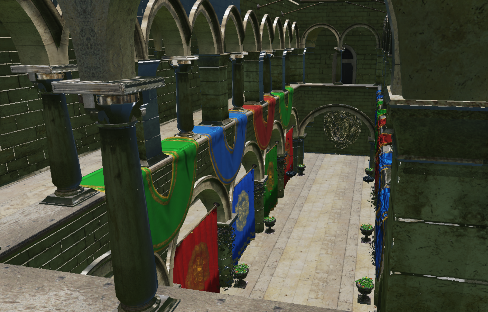

# DX12 Renderer

一个基于 DirectX 12 的实时渲染项目，当前实现重点围绕金属度-粗糙度 PBR、基于 split-sum approximation 的 IBL 预计算流程以及真实阴影映射展开。项目代码位于 [`DX12/`](./DX12) 目录。



上图是作者使用外部 Sponza / HDR 资源记录的效果。干净 clone 默认运行程序生成的 PBR 校验场景与小型环境贴图；复现该截图需要自行准备有许可的外部模型与 HDR。

## Highlights

- DirectX 12 forward pipeline：描述符堆、多帧常量/资源同步、独立 shadow pass 与 `3×3 PCF`。
- GGX metallic-roughness PBR：HDR 经纬环境输入、irradiance / prefilter / BRDF LUT 的 split-sum IBL。
- OBJ / MTL 材质与切线空间法线、alpha mask；ImGui / ImGuizmo 场景检查和 transform 编辑。

## 当前特性

- 基于 `DirectX 12 + Win32` 的基础渲染框架
  - 设备与交换链初始化
  - 命令列表与命令队列管理
  - 描述符堆与多帧资源管理
- 金属度-粗糙度 PBR 材质流程
  - `baseColor`
  - `normal`
  - `roughness`
  - `metallic`
- 基于微表面模型的直接光照
  - `GGX NDF`
  - `Smith Geometry`
  - `Schlick Fresnel`
- 切线空间法线贴图
- 基于 HDR 经纬图的环境光照
  - HDR 浮点纹理加载
  - 环境贴图 mip 链生成
  - `irradiance map`
  - `prefiltered environment map`
  - `BRDF LUT`
  - 基于 split-sum approximation 的 diffuse / specular IBL
  - HDR 天空背景显示
- 真实阴影映射
  - 独立 shadow map 深度预通道
  - 比较采样
  - `3x3 PCF`
- 后处理
  - ACES tone mapping
  - gamma correction
- 资源导入
  - `tinyobjloader`
  - `stb_image`
  - `DDSTextureLoader`
  - OBJ / MTL 静态场景导入

## 当前场景

作者的 Sponza 展示场景用于验证 PBR、IBL、shadow map 与复杂 OBJ 场景资产的组合效果，包含：

- Sponza 静态场景模型
- MTL 材质拆分后的多个子网格
- base color / normal / roughness / metallic / alpha mask 贴图绑定
- HDR 环境贴图背景

当前使用的主要测试资源包括：

- [`DX12/Shaders/Color.hlsl`](./DX12/Shaders/Color.hlsl)
- [`DX12/Shaders/BrdfLut.hlsl`](./DX12/Shaders/BrdfLut.hlsl)
- [`DX12/Shaders/IrradianceMap.hlsl`](./DX12/Shaders/IrradianceMap.hlsl)
- [`DX12/Shaders/PrefilterEnvMap.hlsl`](./DX12/Shaders/PrefilterEnvMap.hlsl)
- [`DX12/Shaders/ShadowMap.hlsl`](./DX12/Shaders/ShadowMap.hlsl)
- [`DX12/Shaders/Sky.hlsl`](./DX12/Shaders/Sky.hlsl)
- 可选 `Model/sponza/sponza.obj` 与其 MTL / textures
- 可选 `images/HDR/suburban_garden_2k.hdr`

这些外部测试资源通过 `DX12_ASSET_ROOT` 指定，不依赖另一份本地工程，也没有在本次清理中复制进仓库。

## 渲染流程

当前主渲染流程可以概括为：

1. 启动阶段生成 IBL 预计算资源
   - irradiance map
   - prefiltered environment map
   - BRDF LUT
2. 渲染 shadow map 深度预通道
3. 渲染 HDR 天空背景
4. 渲染主场景物体
5. 在主着色阶段综合：
   - 直接光照
   - shadow map 阴影
   - diffuse IBL
   - specular IBL
6. 输出前执行 tone mapping 与 gamma correction

## 关键实现文件

- [`DX12/ShapesApp.cpp`](./DX12/ShapesApp.cpp)
  - 场景组织、渲染流程、资源绑定、shadow pass、sky pass
- [`DX12/ShapesApp.h`](./DX12/ShapesApp.h)
  - 场景状态、渲染层级、阴影资源声明
- [`DX12/FrameResources.h`](./DX12/FrameResources.h)
  - 帧资源、Pass 常量与材质常量
- [`DX12/ToolFunc.cpp`](./DX12/ToolFunc.cpp)
  - 纹理加载、HDR 浮点纹理创建、mip 链生成、基础资源辅助函数
- [`DX12/Shaders/LightingTools.hlsl`](./DX12/Shaders/LightingTools.hlsl)
  - PBR 直接光照核心计算
- [`DX12/Shaders/Color.hlsl`](./DX12/Shaders/Color.hlsl)
  - 主着色器、法线贴图、IBL、阴影采样
- [`DX12/Shaders/BrdfLut.hlsl`](./DX12/Shaders/BrdfLut.hlsl)
  - BRDF 积分查找表预计算
- [`DX12/Shaders/IrradianceMap.hlsl`](./DX12/Shaders/IrradianceMap.hlsl)
  - diffuse IBL 半球卷积预计算
- [`DX12/Shaders/PrefilterEnvMap.hlsl`](./DX12/Shaders/PrefilterEnvMap.hlsl)
  - specular IBL 的 GGX 预滤波环境贴图生成
- [`DX12/Shaders/ShadowMap.hlsl`](./DX12/Shaders/ShadowMap.hlsl)
  - 阴影贴图深度预通道
- [`DX12/Shaders/Sky.hlsl`](./DX12/Shaders/Sky.hlsl)
  - HDR 天空背景渲染

## 构建方式

### CMake

要求 Windows、DirectX 12 feature level 12.0 的 GPU/驱动、Visual Studio 2022 Desktop development with C++ workload（v143）、Windows SDK，以及 CMake 3.21+。`tinyobjloader`、`stb_image`、Dear ImGui 1.90.9 与 ImGuizmo 已 vendored，不需要外部 DirectX-Headers 目录。

在仓库根目录：

```powershell
cmake -S . -B build -G "Visual Studio 17 2022" -A x64
cmake --build build --config Release
.\build\Release\DX12Renderer.exe
# 隐藏窗口，完成着色器/IBL初始化与 10 帧渲染后退出：
$process = Start-Process .\build\Release\DX12Renderer.exe -ArgumentList '--smoke' -Wait -PassThru -WindowStyle Hidden
$process.ExitCode
```

CMake 将 `Shaders/`、`Textures/`、`Models/` 复制到 executable 旁。程序也会从 executable / 当前目录的祖先定位仓库 `DX12/`，因此 Visual Studio 工程启动不需要本机绝对路径。MSVC 的 C++23 配置使用 `/std:c++latest`，兼容这里验证的 VS2022 工具集。部分旧 Win32 源码与 header 使用 CP936 注释，构建显式保留该输入字符集。

`--smoke` 退出码 0 表示初始化与有限帧运行完成；它不替代截图画质、性能或完整交互验证。Debug 配置需要 Windows Graphics Tools 的 D3D12 debug layer。

### Visual Studio 工程

推荐环境：

- Visual Studio 2022
- Windows SDK
- x64 平台

可直接打开：

- [`DX12/D3D12.slnx`](./DX12/D3D12.slnx)
- [`DX12/WindowsProject1.vcxproj`](./DX12/WindowsProject1.vcxproj)

建议使用：

- `x64 | Debug`
- `x64 | Release`

项目中已包含：

- `DXMath`
- `tiny_obj_loader`
- `stb_image`
- `DDSTextureLoader`

## 可选外部资源

默认运行所需的 sample DDS / skull 已在仓库中；缺少外部 Sponza、HDR 或 Metal1 贴图时，使用 procedural geometry、factor-based PBR 与代码生成的 linear lat-long 环境，仍执行 IBL / shadow / PBR 主链路。默认效果与 Sponza 截图不同。

外部资源目录示例：

```text
optional-assets/
  Model/sponza/sponza.obj        # MTL 和贴图相对模型目录
  images/HDR/suburban_garden_2k.hdr
  images/Metal1/Metal049A_2K-JPG_Color.jpg
  images/Metal1/Metal049A_2K-JPG_NormalDX.jpg  # 或 NormalGL，自动翻转 Y
  images/Metal1/Metal049A_2K-JPG_Roughness.jpg
  images/Metal1/Metal049A_2K-JPG_Metalness.jpg
```

```powershell
$env:DX12_ASSET_ROOT = (Resolve-Path .\optional-assets).Path
.\build\Release\DX12Renderer.exe
```

也支持 runtime 目录下 `Assets/` 的同一结构，以及 `Models/Sponza/sponza.obj`。没有自动下载步骤；请保留模型/HDR/纹理的许可和来源。构建输出外放时，将 `Shaders/`、`Textures/`、`Models/` 与 executable 一起保留。

HDR / 图像路径按 Windows Unicode → UTF-8 传给 stb_image；OBJ / MTL 导入仍使用现有 narrow-path 接口，非 ASCII 模型目录还没有完整验证。

## 操作方式

- 鼠标右键拖动：相机旋转
- 鼠标左键拖动：前进 / 后退
- 鼠标中键拖动：上下移动
- 方向键：调整主光源方向
- ImGui 面板：导入 OBJ、选择物体、编辑 transform / ImGuizmo gizmo、截图

## 当前限制

当前实现已经具备一条较完整的实时 PBR 主链路，包括基于 split-sum approximation 的 IBL 预计算流程，但仍属于 forward renderer 的阶段性版本。后续仍可继续扩展：

- 更完整的场景资源组织
- `SSAO / SSR / SSGI`
- `DXR`

## 项目定位

该项目用于验证实时渲染中的核心基础模块如何在 DirectX 12 中完成工程化落地，包括资源管理、材质系统、基于 IBL 的环境光照、阴影映射与着色器协作。当前版本已经能够较完整地展示一条可运行的实时 PBR 主链路，并为后续扩展更复杂的实时渲染特性提供基础。

## 引用与许可

- [tinyobjloader](https://github.com/tinyobjloader/tinyobjloader) / [stb](https://github.com/nothings/stb)：vendored header 保留原始许可。
- [Dear ImGui](https://github.com/ocornut/imgui/tree/v1.90.9) / [ImGuizmo](https://github.com/CedricGuillemet/ImGuizmo)：MIT；Dear ImGui notice 已按 vendored 版本恢复。
- Microsoft D3D12 / DDS / MiniEngine-derived utilities 与 Frank Luna `MathHelper` 的文件内来源说明保持不变。
- [ASSETS.md](./ASSETS.md) 记录 sample DDS、模型与其他第三方内容的许可证据和待确认项。仓库 MIT LICENSE 不会自动覆盖这些资产。
